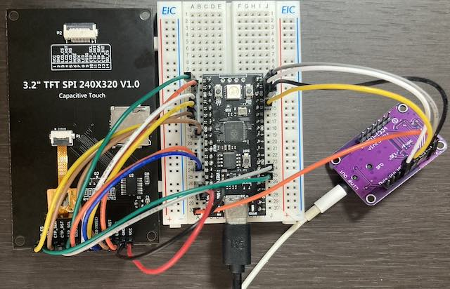

# 東方BGM on VGS for RaspberryPi Pico


## About

- 本リポジトリでは、同人ハードウェア版 東方BGM on VGS (東方VGS実機版) のファームウェアと組み立て手順を提供します
- 東方VGS実機版 は、東方Project二次創作です
- 東方VGS実機版 は、各自で部品を集めて組み立てるものです
- [誰でも自由に 東方VGS実機版 を販売できます](#hardware-sales)

## Required Parts and Tools

東方VGS実機版の組み立てに必要な部品と工具を示します。

### Parts

__（日本国内で調達できない部品）__

- [RP2040: Type-C 16MB (SoC)](https://ja.aliexpress.com/item/1005004005660504.html)
  - RaspberryPi Pico の開発ボードの互換製品です
  - 国内でも調達できる純正の RaspberryPi Pico だとフラッシュ容量不足のため全曲を入れることはできません
- [MSP3223: ILI9341+FT6336U "3.2 with Touch (LCD+CTP)](https://ja.aliexpress.com/item/1005005878590372.html)
  - 必ず **3.2 with Touch** （または 2.8 with Touch）を選択してください
    - 3.5 インチモデルのディスプレイ IC（ST7796U）には未対応です
    - タッチ無しのモデルでは操作ができないため選択しないで下さい
  - タッチ IC に `FT6336`、ディスプレイ IC に `ILI9341` を搭載した LCD であれば、他のものでも正常に動作します
- [UDA1334A (DAC)](https://ja.aliexpress.com/item/1005001993192815.html)
  - UDA1334A は EOL (生産終了) なので純正品の調達は現在できません
  - 上記リンクは互換製品です
  - UDA1334A でなくても I2S インタフェースの DAC であれば恐らく問題ありません

> - SoC: System on a Chip (システムチップ)
> - LCD: Liquid Crystal Display (液晶ディスプレイ)
> - CTP: Capacitive Touch Panel (静電容量式タッチパネル)
> - DAC: Digital to Analog Converter (D/A変換機)

__（日本国内で調達可能な部品）__

- [ブレッドボード](https://www.marutsu.co.jp/pc/i/14660/)
- [ジャンパー線♂♀](https://www.marutsu.co.jp/pc/i/69682/) x 18本

### Tools

- ハンダゴテ
- ハンダゴテ台
- ハンダ

> 上記の工具は、RP2040 と UDA1334A のピンヘッダを取り付けに必要です。

## PIN assign

ブレッドボードとジャンパー線を用いて、各モジュールを下表のように配線してください。

|RP2040 (SoC)|ILI9341 (LCD)|FT6336U (CTP)|UDA1334A (DAC)|
|:-|:-|:-|:-|
|6: `GPIO4`|-|`CTP_SDA`|-|
|7: `GPIO5`|-|`CTP_SCK`|-|
|17: `GPIO13`|-|-|`DIN`|
|18: `GND`|-|-|`GND`|
|19: `GPIO14`|-|-|`BCLK`|
|20: `GPIO15`|-|-|`WSEL`|
|21: `GPIO16`|`SDO (MISO)`|-|-|
|22: `GPIO17`|`LCD_CS`|-|-|
|24: `GPIO18`|`SCK`|-|-|
|25: `GPIO19`|`SDI (MOSI)`|-|-|
|26: `GPIO20`|-|`CTP_RST`|-|
|27: `GPIO21`|-|`CTP_INT`|-|
|29: `GPIO22`|`LCD_RST`|-|-|
|32: `GPIO27`|`LED`|-|-|
|34: `GPIO28`|`LCD_RS or LCD_DC`|-|-|
|36: `3.3V`|`VCC`|-|-|
|38: `GND`|`GND`|-|-|
|40: `VOUT (5V)`|-|-|`VIN`|



## Install Firmware

1. [最新リリース](https://github.com/suzukiplan/tohovgs-pico/releases) から firmware.uf2 をダウンロード
2. パソコンに RP2040 の BOOT (BOOTSEL) ボタンを押しながら USB ケーブルを接続
3. リムーバブルメディア RPI-RP2 に firmware.uf2 をコピー＆ペースト

## Build Firmware

### Build Support OS

- Linux
- macOS

> （補足事項）
>
> - ビルドに iconv コマンドが必要なため UNIX と互換性のある OS のビルドのみサポートしています（Windows でのビルドをサポートする予定はないので Linux または macOS を準備するか WSL2 をご使用ください）
> - Linux は Ubuntu でビルド確認しています（おそらく Debian や Raspberry Pi Desktop 等でのビルドも可能だと思われます）

### Required Middleware

- [PlatformIO Core](https://github.com/platformio/platformio-core)
- GNU Make
- GCC C/C++

### How to Build

RP2040 の BOOT ボタンを押しながら PC へ USB 接続後、以下のコマンドを実行すればビルドとフラッシュの書き込みが実行されます。

```bash
make
```

フラッシュの書き込みをせずにビルドのみ行いたい場合は `build` オプションを指定してください。

```bash
make build
```

## License

### Software

本プログラムのライセンスは [GPLv3](LICENSE.txt) とします。

また、本プログラムでは以下の Open Source Software や素材を利用しています。

- LZ4 Library
  - Web Site: [https://github.com/lz4/lz4](https://github.com/lz4/lz4) - [lib](https://github.com/lz4/lz4/tree/dev/lib)
  - License: [2-Clause BSD](./licenses-copy/lz4-library.txt)
  - `Copyright (c) 2011-2020, Yann Collet`
- TFT eSPI
  - Web Site: [https://github.com/Bodmer/TFT_eSPI](https://github.com/Bodmer/TFT_eSPI)
  - License: [Combined Licenses](./licenses-copy/TFT_eSPI.txt)
  - `Copyright (c) 2012 Adafruit Industries.  All rights reserved.`
  - `Copyright (c) 2023 Bodmer (https://github.com/Bodmer)`
- 8×12 ドット日本語フォント「k8x12」
  - Web Site: [https://littlelimit.net/k8x12.htm](https://littlelimit.net/k8x12.htm)
  - License: [Original](./licenses-copy/k8x12.txt)
- Video Game System SDK - Pico
  - Web Site: [https://github.com/suzukiplan/vgssdk-pico](https://github.com/suzukiplan/vgssdk-pico)
  - License: [MIT](./licenses-copy/vgssdk.txt)
  - `Copyright (c) 2023 Yoji Suzuki.`

### Hardware Sales

次の条件を満たす場合、自身が開発した 東方VGS実機版 を販売することを許諾します。

1. [東方Project（本家）の二次創作ガイドライン](https://touhou-project.news/guideline/)に反しないこと
2. 製品マニュアル等に使用している OSS ライセンスを明示すること
3. 購入者が自由に製品フラッシュメモリを更新する権利を奪うことを禁じます（具体的には、購入者が本リポジトリから最新のファームウェアに更新できる手段を提供することを必須要件とします）
4. 販売に関する全ての保証業務（購入者へのサポート等）は、仮に本リポジトリ提供内容の不具合に起因する場合であっても全て販売者の責任で実施すること

可能な限り販売開始前または販売開始後に X (旧 Twitter) で [suzukiplan](https://twitter.com/suzukiplan) をフォローの上、以下のメンションを投げてください。（これは強制ではありません）

```
@suzukiplan 東方VGS実機版の販売をします 
https://example.com/1234
```

> https://example.com/1234 は通販サイトの商品販売リンクに置き換えてください。
